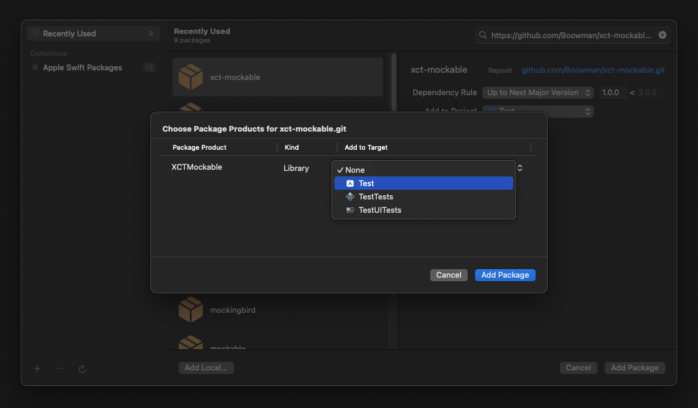

# XCTMockable

<div>
    <a href="https://github.com/Boowman/xct-parameterize"></a>
    <a href="https://www.swift.org/"></a>
    <a href="https://developer.apple.com/xcode/"></a>
    <a href="https://github.com/Boowman/xct-Parameterize?tab=MIT-1-ov-file"></a>
</div>

## Table of contents

- [Summary](https://github.com/Boowman/xct-mockable?tab=readme-ov-file#summary)
- [Requirements](https://github.com/Boowman/xct-mockable?tab=readme-ov-file#requirements)
- [Installation](https://github.com/Boowman/xct-mockable?tab=readme-ov-file#installation)
    - [SPM](https://github.com/Boowman/xct-mockable?tab=readme-ov-file#swift-package-manager)
    - [Package](https://github.com/Boowman/xct-mockable?tab=readme-ov-file#adding-it-to-a-package)
- [Package Support](https://github.com/Boowman/xct-mockable?tab=readme-ov-file#support)
- [Essentials](https://github.com/Boowman/xct-mockable?tab=readme-ov-file#essentials)
    - [Mocking](https://github.com/Boowman/xct-mockable?tab=readme-ov-file#mocking)
    - [Stubbing](https://github.com/Boowman/xct-mockable?tab=readme-ov-file#stubbing)
    - [Verification](https://github.com/Boowman/xct-mockable?tab=readme-ov-file#verification)
    - [Matching Arguments](https://github.com/Boowman/xct-mockable?tab=readme-ov-file#matching-arguments)

## Summary


## Requirements

Xcode 15 or above
Swift 5.9 or later

## Installation

#### Swift Package Manager

1. In Xcode, navigate to the menu: File > Swift Packages > Add Package Dependency
2. Add `https://github.com/Boowman/xct-mockable.git`
3. For the Dependency Rule, Select "Up to Next Major" with `1.0.0`. Click Add Package.
4. Under `Package Product` look for XCTMockable and under `Target` select your test target.
5. Click Add Package.

<p align="left">
    
</p>

#### Adding it to a package

1. In `Package.swift` add:

``` swift
    dependencies: [
        ...
      .package(url: "https://github.com/Boowman/xct-mockable", branch: "1.0.0")
    ]
```

2. Add the product to your target again inside `Package.swift`

```swift
    .target(
        name: <Your Target>,
        dependencies: [
            ...
            .product(name: "XCTMockable", package: "XCTMockable"),
        ]
    )
```

## Support

<table>
  <tr>
    <th width="400px"></th>
    <th width="150px">XCTMockable</th>
  </tr>
  <tr>
    <td width="400px">Protocol Mocks</td>
    <td width="150px">✅</td>
  </tr>
  <tr>
    <td width="400px">Class Mocks</td>
    <td width="150px">❌</td>
  </tr>
</table>

<table>
  <tr>
    <th width="400px"></th>
    <th width="150px"></th>
  </tr>
  <tr>
    <td width="400px">Protocol Inheritance</td>
    <td width="150px">❌</td>
  </tr>
  <tr>
    <td width="400px">Class Inheritance</td>
    <td width="150px">❌</td>
  </tr>
  <tr>
    <td width="400px">External Type Inheritance</td>
    <td width="150px">❌</td>
  </tr>
</table>

<table>
  <tr>
    <th width="400px"></th>
    <th width="150px"></th>
  </tr>
  <tr>
    <td width="400px">Annotated Protocols</td>
    <td width="150px">✅</td>
  </tr>
  <tr>
    <td width="400px">Attributes Methods</td>
    <td width="150px">✅</td>
  </tr>
</table>

<table>
  <tr>
    <th width="400px"></th>
    <th width="150px"></th>
  </tr>
  <tr>
    <td width="400px">Method</td>
    <td width="150px">✅</td>
  </tr>
  <tr>
    <td width="400px">Properties</td>
    <td width="150px">✅</td>
  </tr>
  <tr>
    <td width="400px">Subscripts</td>
    <td width="150px">✅</td>
  </tr>
  <tr>
    <td width="400px">Static Methods</td>
    <td width="150px">✅</td>
  </tr>
  <tr>
    <td width="400px">Static Properties</td>
    <td width="150px">✅</td>
  </tr>
  <tr>
    <td width="400px">Async Properties</td>
    <td width="150px">❌</td>
  </tr>
  <tr>
    <td width="400px">Async Throws Properties</td>
    <td width="150px">❌</td>
  </tr>
  <tr>
    <td width="400px">Async Methods</td>
    <td width="150px">✅</td>
  </tr>
  <tr>
    <td width="400px">Async Throws Methods</td>
    <td width="150px">✅</td>
  </tr>
  <tr>
    <td width="400px">Throws Methods</td>
    <td width="150px">✅</td>
  </tr>
  <tr>
    <td width="400px">Attributes</td>
    <td width="150px">✅</td>
  </tr>
  <tr>
    <td width="400px">Self</td>
    <td width="150px">✅</td>
  </tr>
</table>

<table>
  <tr>
    <th width="400px"></th>
    <th width="150px"></th>
  </tr>
  <tr>
    <td width="400px">Stub Return Value</td>
    <td width="150px">✅</td>
  </tr>
  <tr>
    <td width="400px">Stub Throwing Errors</td>
    <td width="150px">❌</td>
  </tr>
  <tr>
    <td width="400px">Stub Parameterised Methods</td>
    <td width="150px">✅</td>
  </tr>
  <tr>
    <td width="400px">Variadic Parameters</td>
    <td width="150px">✅</td>
  </tr>
  <tr>
    <td width="400px">Stub Inout Parameters</td>
    <td width="150px">❌</td>
  </tr>
  <tr>
    <td width="400px">Stub Sequences</td>
    <td width="150px">❌</td>
  </tr>
</table>

<table>
  <tr>
    <th width="400px"></th>
    <th width="150px"></th>
  </tr>
  <tr>
    <td width="400px">Nested Classes</td>
    <td width="150px">❌</td>
  </tr>
  <tr>
    <td width="400px">Type Aliasing</td>
    <td width="150px">❌</td>
  </tr>
  <tr>
    <td width="400px">Fully-Qualified Types</td>
    <td width="150px">❌</td>
  </tr>
  <tr>
    <td width="400px">Compilation Conditions</td>
    <td width="150px">❌</td>
  </tr>
</table>

<table>
  <tr>
    <th width="400px"></th>
    <th width="150px"></th>
  </tr>
  <tr>
    <td width="400px">Extract Argument Matching</td>
    <td width="150px">❌</td>
  </tr>
  <tr>
    <td width="400px">Wildcard Argument Matching</td>
    <td width="150px">❌</td>
  </tr>
</table>

<table>
  <tr>
    <th width="400px"></th>
    <th width="150px"></th>
  </tr>
  <tr>
    <td width="400px">Relaxed Mocks</td>
    <td width="150px">❌</td>
  </tr>
  <tr>
    <td width="400px">In Order Verification</td>
    <td width="150px">❌</td>
  </tr>
  <tr>
    <td width="400px">Asynchronous Verification</td>
    <td width="150px">❌</td>
  </tr>
  <tr>
    <td width="400px">Thread-Safe Testing</td>
    <td width="150px">❌</td>
  </tr>
  <tr>
    <td width="400px">Argument Capturing</td>
    <td width="150px">❌</td>
  </tr>
</table>

<table>
  <tr>
    <th width="400px"></th>
    <th width="150px"></th>
  </tr>
  <tr>
    <td width="400px">Primitive Types</td>
    <td width="150px">✅</td>
  </tr>
  <tr>
    <td width="400px">Nullable Types</td>
    <td width="150px">✅</td>
  </tr>
  <tr>
    <td width="400px">Custom Objects</td>
    <td width="150px">✅</td>
  </tr>
  <tr>
    <td width="400px">Array</td>
    <td width="150px">✅</td>
  </tr>
  <tr>
    <td width="400px">Async</td>
    <td width="150px">✅</td>
  </tr>
  <tr>
    <td width="400px">Throws</td>
    <td width="150px">✅</td>
  </tr>
  <tr>
    <td width="400px">Async Throws</td>
    <td width="150px">✅</td>
  </tr>
  <tr>
    <td width="400px">Async Throws Type</td>
    <td width="150px">✅</td>
  </tr>
</table>

## Essentials
### Example

```swift
// Mocking
@Mockable
protocol XCTMockable {
    var isAvailable: Bool { get set }
    func setAvailability()
}

// Will Produce
class XCTMockableMock: XCTMockable {
    ...
}

// Usage
var xctMockable = XCTMockableMock()

// Stubbing
given(xctMockable.isAvailable).willReturn(true)

// Verification
verify(xctMockable.isAvailable).wasCalled()

// Result
var isAvailable = xctMockable.isAvailable

// Assert
XCTAssertTrue(isAvailable)
```

### Mocking
To mock a protocol we simply have to provide the `@Mockable` macro to the protocol itself, everything will be taken care of in the background.
The result will be a newly created class with the appended `Mock` keyword to the function name itself. Any supported type and method will be created within the class
and given the appropriate context to be able to use it in the tests.

```swift
@Mockable
protocol XCTMockable {
    var isAvailable: Bool { get set }
    func setAvailability(val: Bool) -> Bool?
}

class XCTMockableMock: XCTMockable {
    var isAvailable: Bool {
        get {
            ...
        }
        set { }
    }

    func setAvailability(val: Bool) -> XCTMockable.Mockable<XCTMockable.FunctionDeclaration, (_ val: Bool) -> Bool?, Bool?> {
        return ...
    }
    
    func setAvailability(val: Bool) -> Bool? {
        return ...
    }
}
```

### Stubbing
We have the option to stub any type currently supported by Swift from `primitive types`, `custom objects` to `self`

#### Initialisers
Currently the `init` is being created as part of the protocol though they will not be usable at the moment.

#### Primitive properties AND objects

```swift
given(xctMockable.isAvailable).willReturn(true)
given(xctMockable.isAvailable).willReturn(nil)
given(xctMockable.product).willReturn(Product(id: "x125",title: "Title",date: Date(timeIntervalSince1970: 1708387889), price: 49.99))
```

#### Static properties OR methods

We can also return `Self` or static properties when we want to verify instances.
```swift
@Mockable
protocol XCTMockable {
    static var instance: Self { get }    
    var shared: Self { get }
}

final class XCTMockableClass: XCTMockable {
    ...
}

let mockableClass = XCTMockableClass()
```

```swift
// self
given(xctMockable.shared).willReturn(mockableClass)

// static self
given(XCTMockableMock.instance).willReturn(mockableClass)
```

#### Methods Regular & Variadic
```swift
@Mockable
protocol MethodsProtocol {
    func fetchProduct(id: String) -> String
    func fetchContents(_ ids: String...) -> [String]?
}
```

```swift
let methodsMock = MethodsProtocolMock()
```

```swift
given(methodsMock.fetchProduct(id: "1")).willReturn("1")
given(methodsMock.fetchContents("1", "2", "3")).willReturn(["2", "3", "1"])
```

#### Subscript
```swift
@Mockable
protocol SubscriptProtocol {
    subscript(index: Int) -> String { get set }
}
```

```swift
let subscriptMock = SubscriptProtocolMock()
```

```swift
given(subscriptMock[0]).willReturn("Some data")

let passProduct = Product(id: "x1", title: "Titles", date: Date(timeIntervalSince1970: 1708387889), price: 49.99)
given(subscriptMock[passProduct]).willReturn(product)
```


#### Async method
```swift
@Mockable
protocol AsyncProtocol {
    func setAvailability(val: Bool) async -> Bool
}
```

```swift
let asyncMock = AsyncProtocolMock()
```

```swift
given(await asyncMock.setAvailability(val: True))).willReturn(True)
```

#### Async Throws methods
```swift
@Mockable
protocol AsyncThrowsProtocol {
    func setAvailability(val: Bool) async throws -> Bool
}
```

```swift
let asyncThhrowsMock = AsyncThrowsProtocolMock()
```

```swift
given(try await asyncThhrowsMock.setAvailability(val: True))).willReturn(True)
```

#### Throws methods
```swift
@Mockable
protocol ThrowsProtocol {
    func setAvailability(val: Bool) throws -> Bool
}
```

```swift
let throwsMock = ThrowsProtocolMock()
```

```swift
given(try throwsMock.setAvailability(val: True))).willReturn(True)
```

### Verification

#### Primitive properties AND objects

```swift
verify(xctMockable.isAvailable).wasCalled()
verify(xctMockable.isAvailable).wasCalled(3)
verify(xctMockable.isAvailable).wasNeverCalled()
```

#### Static properties OR methods

We can also return `Self` or static properties when we want to verify instances.
```swift
@Mockable
protocol XCTMockable {
    static var instance: Self { get }    
    var shared: Self { get }
}

final class XCTMockableClass: XCTMockable {
    ...
}

let mockableClass = XCTMockableClass()
```

```swift
// self
verify(propertiesMock.shared).wasCalled()

// static self
verify(PropertiesProtocolMock.instance).wasCalled()
```

#### Methods Regular & Variadic
```swift
@Mockable
protocol MethodsProtocol {
    func fetchProduct(id: String) -> String
    func fetchContents(_ ids: String...) -> [String]?
}
```

```swift
let methodsMock = MethodsProtocolMock()
```

```swift
verify(fetchProduct(id: "1")).wasCalled()
verify(methodsMock.fetchContents("1", "2", "3")).wasCalled()
```

#### Subscript
```swift
@Mockable
protocol SubscriptProtocol {
    subscript(index: Int) -> String { get set }
}
```

```swift
let subscriptMock = SubscriptProtocolMock()
```

```swift
verify(subscriptMock[0]).wasCalled()

let passProduct = Product(id: "x1", title: "Titles", date: Date(timeIntervalSince1970: 1708387889), price: 49.99)
verify(subscriptMock[passProduct]).wasCalled()
```

#### Async method
```swift
@Mockable
protocol AsyncProtocol {
    func setAvailability(val: Bool) async -> Bool
}
```

```swift
let asyncMock = AsyncProtocolMock()
```

```swift
verify(await asyncMock.fetchData()).wasCalled()
```

#### Async Throws methods
```swift
@Mockable
protocol AsyncThrowsProtocol {
    func setAvailability(val: Bool) async throws -> Bool
}
```

```swift
let asyncThhrowsMock = AsyncThrowsProtocolMock()
```

```swift
verify(try await asyncMock.setAvailability(val: True)).wasCalled()
```

#### Throws methods
```swift
@Mockable
protocol ThrowsProtocol {
    func setAvailability(val: Bool) throws -> Bool
}
```

```swift
let throwsMock = ThrowsProtocolMock()
```

```swift
verify(try asyncMock.setAvailability(val: True)).wasCalled()
```

### Matching Arguments
Currently, whenever we stub a method we are required to provide a value for each parameter by doing so we also are able to match that the correct method was called when we verify.

```swift
@Mockable
protocol MethodProtocol {
    func setAvailability(val: Bool) throws -> Bool
}
```

```swift
let methodMock = MethodProtocolMock()
```

```swift
given(methodMock.setAvailability(val: True)).willReturn(True)

verify(methodMock.setAvailability(val: True)).wasCalled()
```

```swift
given(methodMock.setAvailability(val: True)).willReturn(True)

verify(methodMock.setAvailability(val: False)).wasNeverCalled()
```

